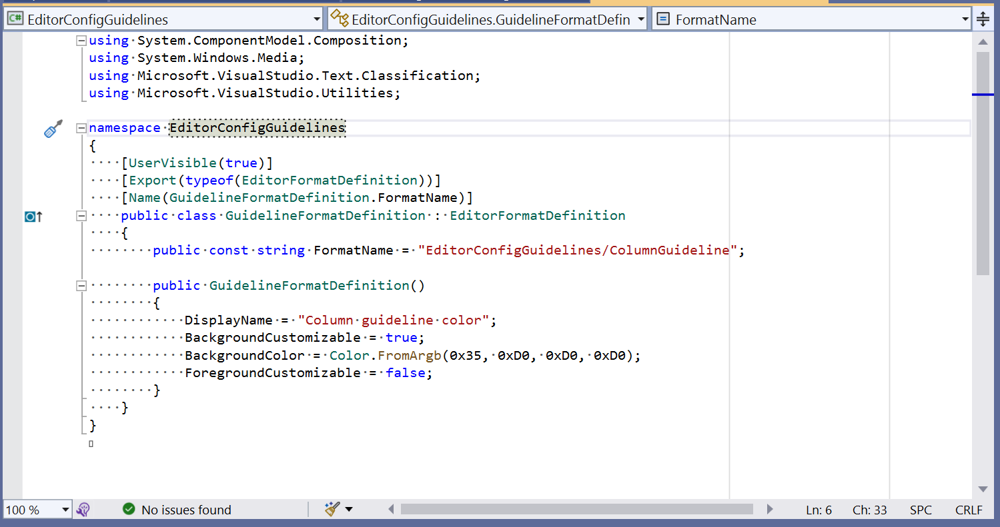
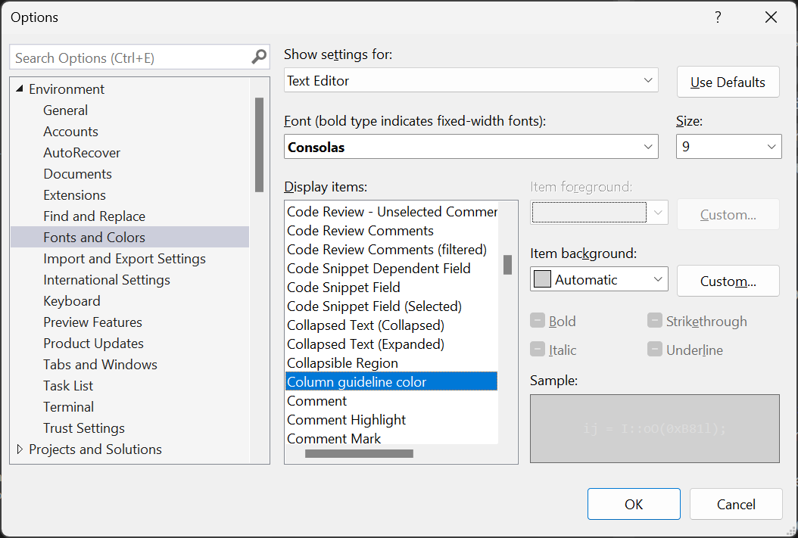

# EditorConfig Guidelines

EditorConfig Guidelines extension add support for new `guideline` property
in [`.editorconfig`](https://editorconfig.org/). This property adds column
guideline in text editor:




Sample `.editorconfig`:
```ini
root = true

[*]
guidelines = 80 dashed, 100
```

See [configuration](#configuration) section for more details.

### Features
- .editorconfig zero-configuration. Ideal for teams.
- Theming support.
- Customizable guideline color.
- **No** telemetry.

### Installation

#### Using Visual Studio Extension manager
1. Start Visual Studio 2022
2. Open Extensions | Manage Extensions
3. Type EditorConfig
4. Select EditorConfig Guidelines extension and click Install.

#### Automatically install via .vsconfig

Just add .vsconfig to the root directory of your project with content like this:
```xml
{
  "version": "1.0",
  "components": [
  ],
  "extensions": [
    "https://marketplace.visualstudio.com/items?itemName=Ivan.EditorConfigGuidelines",
  ]
}
```

### Configuration

#### Guideline Positions and Styles

To configure column guidelines, use the guidelines property in your `.editorconfig` file with the following syntax:

- **Syntax**: `guidelines = <column> <style>, <column> <style>, ...`
- **Parameters**:
  - `<column>`: The column number where the guideline should appear. Columns
    are numbered from left to right starting at 1, with the guideline drawn
    on the specified column's right edge.
  - `<style>`: The line style, which can be one of the following:
    - `solid`
    - `dashed`
    - `dotted`

**Example:**
```ini
[*.cs]
guidelines = 80 solid, 100 dashed, 120 dotted
```

#### Guideline color

The extension uses standard Visual Studio Fonts and Colors setting to configure
column guidelines color. This setting is per-user, to match Visual Studio theme colors.

To configure guidelines color:
1. Open **Tools** | **Options** from main menu.
2. Select **Environment** | **Fonts and Colors** category.
3. Select **Column guideline color** from Display Items list.
4. Configure item background.
5. Click **OK** to apply changes.



### Changelog

* **1.2.0** (28 September 2025)
  * Add official support for Visual Studio 2026.

* **1.1.0** (06 January 2023)
  * Add option to specify guidelines style (solid, dashed, dotted)
  * Suggest to rate extension on Visual Studio Marketplace.

* **1.0.3** (26 December 2022)
  * Update icon.

* **1.0.1** (26 December 2022)
  * Update display name.

* **1.0.0** (26 December 2022)
  * Initial release.
